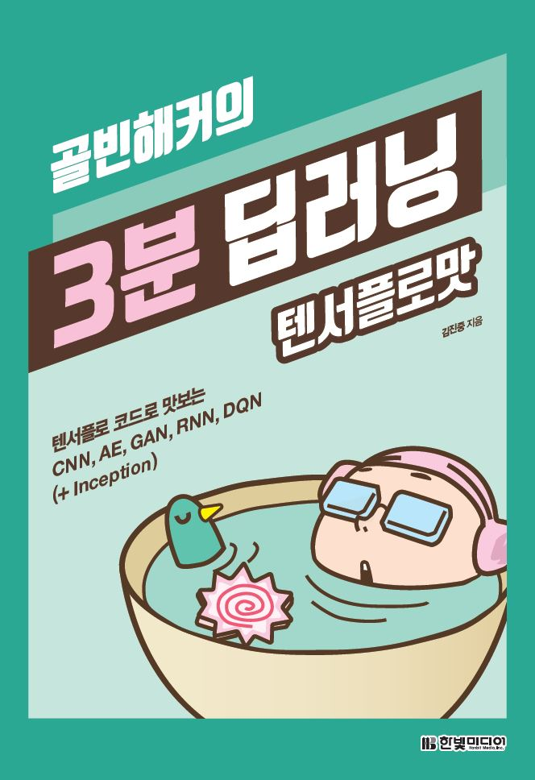

## 골빈해커의 3분 딥러닝 (텐서플로맛)

### Contents

- Chapter01 딥러닝과 텐서플로의 만남
- Chapter02 텐서플로 설치와 주피터 노트북
- Chapter03 텐서플로 프로그래밍 101
- Chapter04 기본 신경망 구현
- Chapter05 텐서보드와 모델 재사용
- Chapter06 헬로 딥러닝 MNIST
- Chapter07 이미지 인식의 은총알 CNN
- Chapter08 대표적 비지도 학습법 Autoencoder
- Chapter09 딥러닝의 미래 GAN
- Chapter10 번역과 챗봇 모델의 기본 RNN
- Chapter11 구글의 핵심 이미지 인식 모델 Inception
- Chapter12 딥마인드가 개발한 강화학습 DQN
